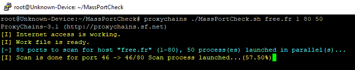
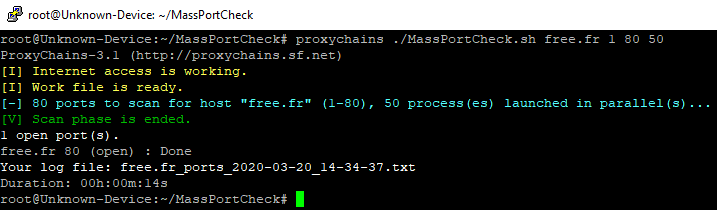

# MassPortCheck :alien: [Version Francaise](https://github.com/choupit0/MassPortCheck/blob/master/README-FR.md)
# Description
Bash script to identify open TCP ports with netcat. No other needs. This is useful with TOR Network. There is no complex scanning process as Nmap or Masscan.
Multiple sessions in parallels for the speed. 

# Some screenshots
Follow the progression:



Complete scan:



# Prerequisites
- netcat utility
```
sudo apt update
sudo apt install netcat
```

# How to install and use it?
Installation:
```
git clone https://github.com/choupit0/MassPortCheck.git
cd MassPortCheck
chmod +x MassPortCheck.sh
```
After you have just to launch the script with for parameters:
```
./MassPortCheck.sh [IP address or hostname] [first port range] [last port range] [number of parallels process]
e.g. proxychains ./MassPortCheck.sh www.acme.org 1 1024 50 (via TOR network)
```
The bash script is compatible with IP addess and hostname. One force of the script is the number of sessions working in parallel, last parameter to set.

**Note that the script will detect if your Internet access is working and if the hostname used is resolvable**
# GIF Demo


# Compatibility
The script has only been tested on Debian family OS but should work on most Linux distributions.

# Known issues
No issues known.
